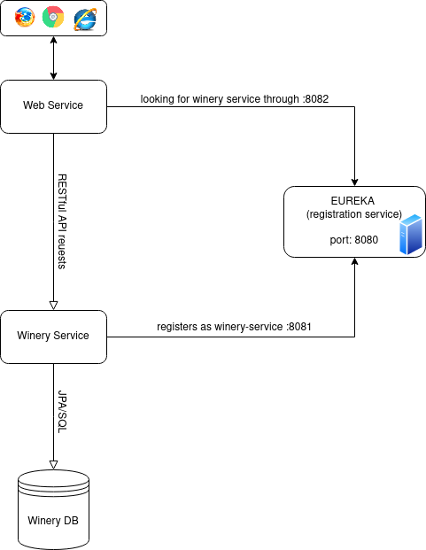

# Run Using Docker

Run Wineries Microservice application #githubrepo with three docker containers for Eureka registration server and one for each microservice.

## Build the Image
1. Build the image with `mvn package` or `gradle assemble`.
   * Command 'mvn' not found, but can be installed with:
   sudo apt install maven
   * Command 'gradle' not found, but can be installed with:
   sudo snap install gradle  # version 7.2, or
   sudo apt  install gradle  # version 4.4.1-13
   * possible issues:
     *`[ERROR] To see the full stack trace of the errors, re-run Maven with the -e switch.`
     * `[ERROR] Re-run Maven using the -X switch to enable full debug logging.`

This will create the jar: `target/wineryDTO-microservices-1.2.0.RELEASE.jar`

2. Install Docker on Linux Ubuntu:

```sh
sudo apt update
sudo apt install docker.io
sudo systemctl start docker
sudo systemctl enable docker
```

3. Dockerfile:

    ```sh
    FROM openjdk:8-jre
    ADD target/wineryDTO-microservices-1.2.0.RELEASE.jar app.jar
    EXPOSE 8080
    EXPOSE 8081
    EXPOSE 8082
    ```

    With this script we are exposing ports 8080,8081 & 8082.
    It uses the OpenJDK 8 docker image as a starting point. It is available at docker hub and it has minimal Linux system with OpenJDK 8 preinstalled.

1. Build the container (**note** the `.` at the end, indicating to use the current directory as its working directory):

    ```sh
    docker build -t microservice .
    ```
   
1. Handling Permission Denied. Otherwise skip to next step.
   1. Add User to Docker Group:
   ```sh
   sudo usermod -aG docker $USER
   ```
   
   2. Verify Group Membership: Check if your user is now part of the docker group:
   ```sh
   groups $USER
   ``` 
   You should see docker in the list of groups. 
   If not, there might be an issue with the group membership changes.
   
   3. Check Docker Socket Permissions: `(/var/run/docker.sock)`
   ```sh
   ls -l /var/run/docker.sock
   ```
   The output should show that the file is owned by the docker group:
   output: srw-rw---- 1 root docker 0 Jan 27 00:00 /var/run/docker.sock

   If it doesn't, you may need to adjust the permissions or ownership:
   ```sh
   sudo chown root:docker /var/run/docker.sock
   sudo chmod 660 /var/run/docker.sock
   ```
   
   4. Restart Docker Service:
    ```sh
       sudo systemctl restart docker
    ```

After trying these steps, try the docker build command again:

   ```sh
      docker build -t microservice .
   ```

1. Check if it's okay. 

    ```sh
    docker images
    ```
   You should see listed `microservice`.

## Running the Application

We will run the container three times, each time running the Java application in a different mode.



1. They need to talk to each other, so let's give them a network:

    ```sh
    docker network create wineries-net
    ```
   
   If you still have permission issues: run it with sudo :)
   You should see something like:
   `0f299d118e832438f21494b190f18d369b32d62e1e91fdc358b2f859c10d8c83`

1. Now run the first container. This runs up the Eureka registration server, which will allow the other microservices to find each other:

    ```sh
    docker run --name eureka --hostname eureka --network wineries-net -p 8080:8080 microservice java -jar app.jar reg
    ```

    The `-d` (detach) flag is missing so all output will stream to the console so we can see what is happening.
    When the applications starts up, you will see the IP.

1. In browser, go to http://localhost:8080 and you should see the Eureka dashboard, without available instances.

1. _In a new CMD/Terminal window_, run a second container for the wineries microservice. This holds a database if there are available wineries (stored using the H2 in-memory RDBMS database)

    ```sh
    docker run --name wineries --hostname wineries --network wineries-net -p 8081:8081 microservice java -jar app.jar wineries  --registration.server.hostname=<IP ADDRESS from eureka server>
    ```

1. Check Eureka Dashboard.  You should see that `WINERIES-SERVICE` is now registered.

1. _In a new CMD/Terminal window_, run a third container for the wineries web-service. This is a web-application for viewing wineryDTO information by requesting wineryDTO data from the wineries microservice.

    ```sh
    docker run --name web --hostname web --network wineries-net -p 8082:8082 microservice java -jar app.jar web --registration.server.hostname=<IP ADDRESS from eureka server>
    ```

1. Return to the Eureka Dashboard in your browser and refresh the screen.  You should see that `WINERIES-SERVICE` and `WEB-SERVICE` are now registered.

1. In a second browser tab, go to http://localhost:8082.  This is the web interface you just deployed and you should be able to view, list and search for wineryDTO information.
